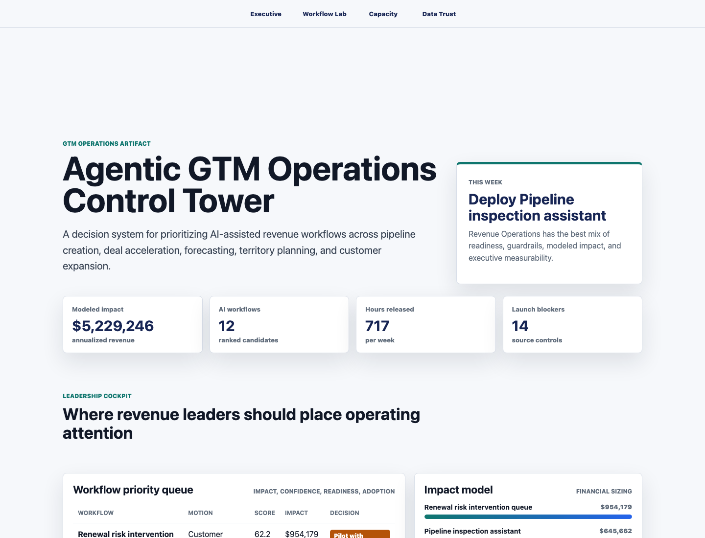
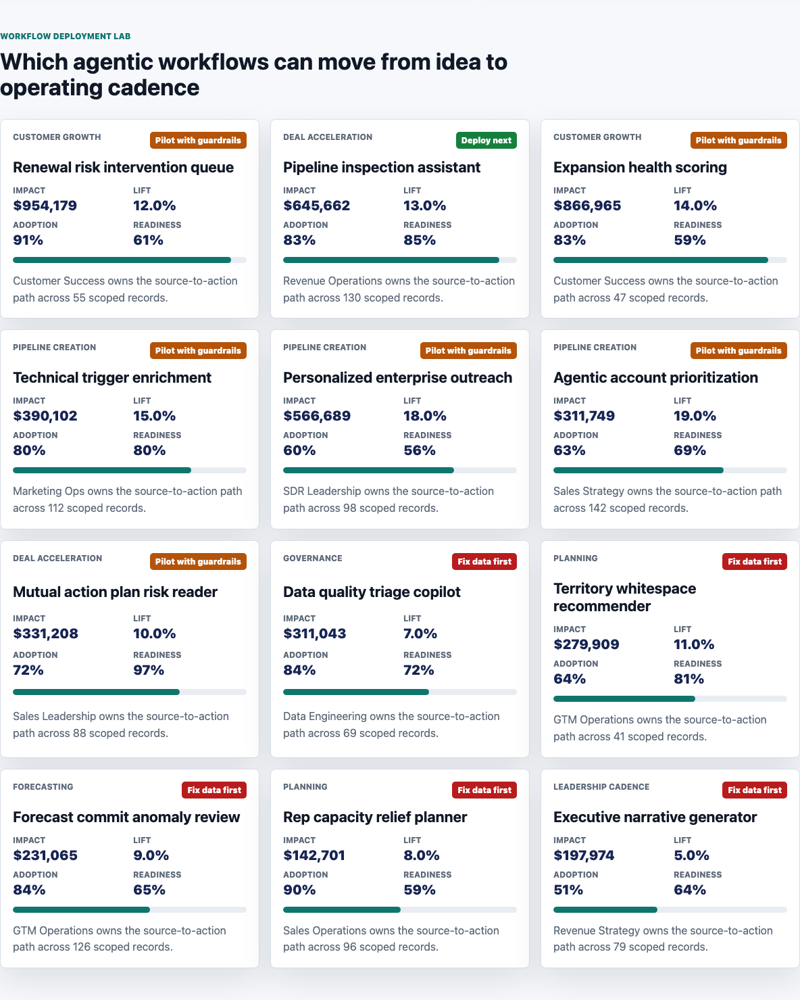
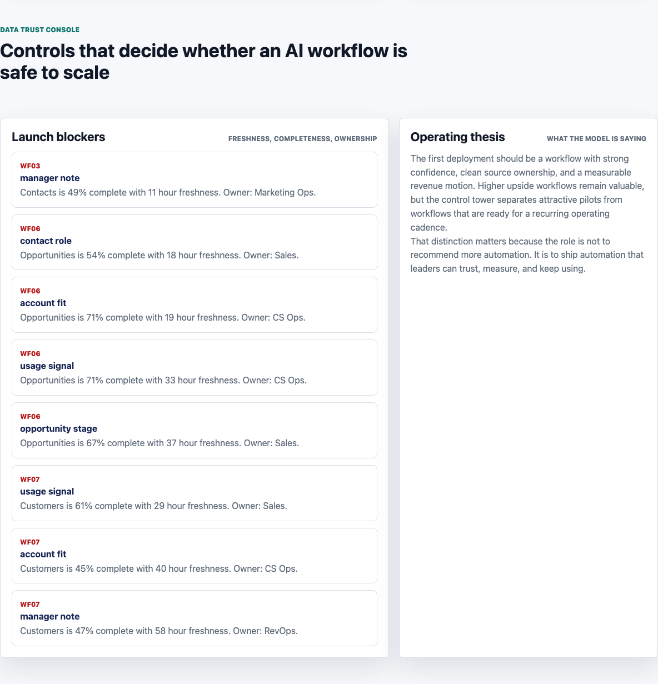

# Agentic GTM Operations Control Tower

An interactive portfolio artifact for a technical B2B infrastructure company that wants to turn AI-assisted revenue workflows into measurable operating programs. The control tower ranks workflow candidates, sizes revenue impact, checks data readiness, and translates the output into deployment, pilot, or source-fix decisions.

The project is designed around a GTM Operations analyst workflow: query the source layer, build a financial model, prioritize AI workflow deployment, inspect territory capacity, and flag the data controls required before automation scales.

## Screenshots



**Executive cockpit:** summarizes modeled annualized revenue impact, workflow count, weekly hours released, launch blockers, and the next deployment recommendation.



**Workflow deployment lab:** ranks AI workflow candidates by motion, modeled revenue impact, expected lift, adoption, data readiness, and deployment decision.



**Data trust console:** shows source launch blockers that must be resolved before higher-upside workflows are safe to scale.

## What This Demonstrates

- AI workflow design across account prioritization, outreach personalization, pipeline inspection, forecasting, renewal risk, expansion health, and territory planning.
- GTM analytics that connect account, opportunity, territory, workflow telemetry, and data quality signals.
- Financial modeling that converts workflow lift, adoption, confidence, and pipeline influence into annualized revenue impact and payback.
- Territory and capacity planning that links automation to quota coverage, rep load, and releasable admin hours.
- Executive communication that separates deployable workflows from attractive pilots and source-data fixes.

## Data Strategy

The data is deterministic and synthetic. It is generated by `scripts/score_operating_data.py` with random seed `42`. No row represents an actual company, customer, prospect, employee, or production system.

The synthetic structure is modeled on common B2B SaaS and infrastructure GTM systems:

- 246 account records across six territories and four GTM segments.
- Account ACV uses triangular distributions from $65K to $720K, adjusted by segment multipliers for strategic, enterprise, mid-market, and customer growth motions.
- Pipeline stages use weighted assignment across target, engaged, stage 1, stage 2, stage 3, commit, and customer states.
- 12 AI workflow candidates cover pipeline creation, deal acceleration, forecasting, customer growth, planning, governance, and leadership cadence.
- Workflow lift assumptions range from 5 percent to 19 percent, with modeled adoption from 43 percent to 91 percent, data readiness from 54 percent to 97 percent, and guardrail scores from 55 to 96.
- Territory pipeline coverage is modeled from quota, open pipeline, stage progression, velocity, forecast risk, and capacity load.
- Data quality checks model source freshness, completeness, definition ownership, and launch blocker status.

## Analysis Outputs

- `analysis/outputs/agent_workflow_scorecard.csv`: ranked workflow queue with impact, readiness, confidence, payback, and recommended decision.
- `analysis/outputs/pipeline_impact_model.csv`: financial sizing of pipeline influence, expected lift, revenue impact, and payback.
- `analysis/outputs/territory_capacity_plan.csv`: territory coverage, capacity load, releasable hours, and planning recommendation.
- `analysis/outputs/data_quality_queue.csv`: source controls that block safe workflow scaling.
- `analysis/outputs/summary.json`: headline metrics used by the browser artifact.

## Run Locally

```bash
python3 scripts/score_operating_data.py
python3 -m http.server 4173
```

Then open `http://localhost:4173`.

## Scope

This is a static portfolio artifact with reproducible synthetic data and transparent rules-based scoring. It does not connect to a live CRM, data warehouse, marketing automation platform, customer success system, or production AI agent. It does show how a GTM Operations analyst can structure an evidence-backed workflow deployment model, defend the assumptions, and turn the result into an executive-ready operating cadence.
